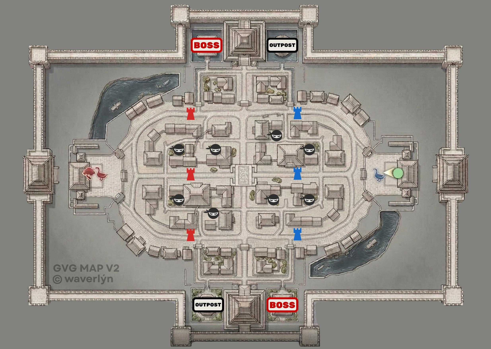

<image src="./guild-war.jpeg" crop="0,0,100,100" scale="100" width="718px" height="397px" float="center"/>

## 📋 Описание

Еженедельное событие, в котором вам предстоит принять участие в матче до 30 игроков, против другой гильдии.

### **Основные задачи:**

-  **Уничтожение башен**/бастионов противника;

   -  Уничтожение каждой башни снижает сопротивление «Гуся» противника;

-  **Убийство «Гуся»**;

-  **Доставка дерева** противника на свою базу.

### Вспомогательные задачи:

-  **Интервальная очистка «Леса»** - убийство NPC, находящихся в центре карты, между линий атак;

   -  Убийство каждого NPC дает команде очки, за которые команда может приобретать усиления;

-  **Убийство NPC босса**, который находится на Севере и Юге карты - там же находятся Аванпосты;

   -  Убийство босса дает команде очки, за которые команда может приобретать усиления;

-  **Убийство NPC босса Аванпоста**, который находится на Севере и Юге карты;

   -  Убийство босса дает владение над Аванпостом, что открывает возможность команде возрождаться там - это позволяет быстрее развивать атаку на вражескую базу;

**Количество матчей в день**: 4.

## 🌍 Карта

<note type="info" title="Подробнее" collapsed="true">

{width=2470px height=1756px}

</note>

## ⏳ **Расписание**

<fragment id="npzk1"/>

## 🎁 Примерные награды

<image src="./guild-war-2.jpeg" crop="0,0,100,100" scale="34" width="357px" height="133px" float="left"/>

*p.s. объём наград зависит от успехов команды и личных успехов*

## 🔗 Связанные страницы

-  [Запись на участие в GvG;](./../guides/guides-gvg-join)