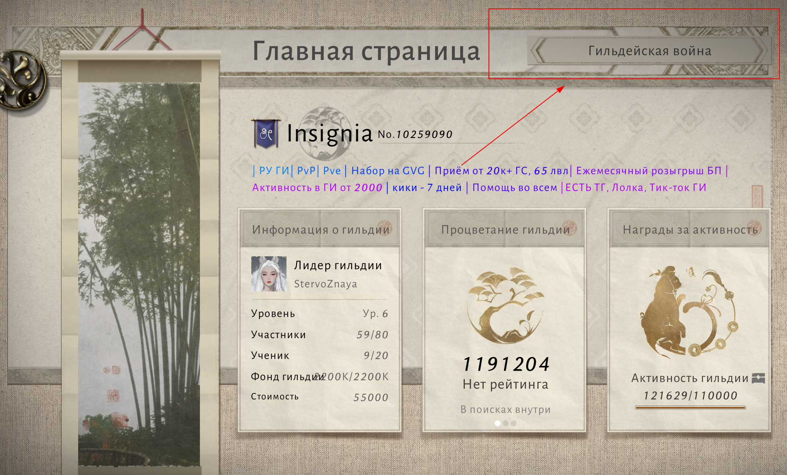

## 📋 Описание

Регистрация на событие [«Гильдейская война»](./../events-quests/event-guild-war) носит еженедельный добровольно-принудительный характер.

**Основная цель данного механизма:**

-  Формирование состава на недели:

   -  Ваша задача за неделю *(начиная с понедельника)* определиться - сможете ли вы принять участие на GvG, выбрав определенные дни участия;

   -  **ВАЖНО**! Поддерживать голос участия актуальным и принять финальное решение не позднее 1 часа до начала первого матча [*(см. Расписание GvG)*](./../events-quests/event-guild-war#⏳-расписание);

-  Благодаря данному механизму командный состав сможет заблаговременно сформировать команды и тактики, не тратя на это время во время матча, что, в свою очередь, приносит много суеты и проблемы;

## 📌 Как принять участие

1. Открыв главную страницу Гильдии, вам необходимо перейти в раздел Гильдейской войны:

   {width=1964px height=1188px}

2. Далее, попав на страницу события «Гильдейская война» - вам необходимо зайти в «Лига»:

   {width=2081px height=1225px}

3. Далее, находясь на странице «Лига» - вам необходимо нажать «Таблица лидеров»:

   {width=1619px height=1335px}

4. И затем, находясь на странице «Таблица лидеров» - вам необходимо нажать кнопку «Запись в лигу»:

   {width=1533px height=1275px}

5. Вуаля! Вы зарегистрированы и командиры, во время подготовки к матчу GvG - будут Вам очень благодарны.